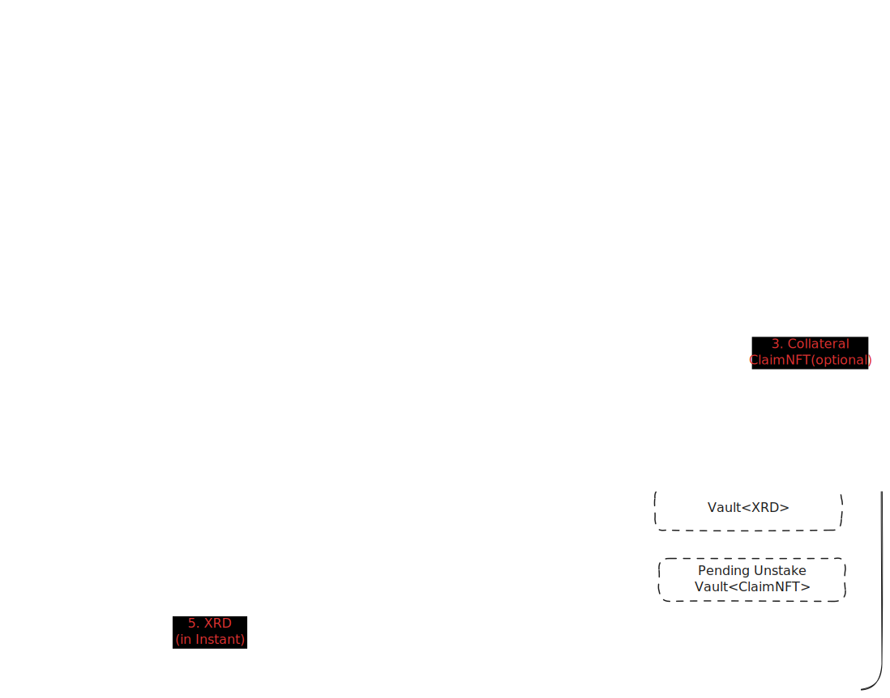
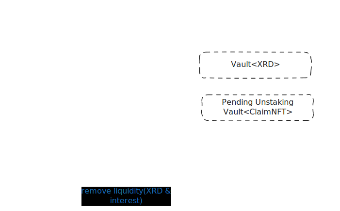

# DeXian Staking Earning by DeXian 

Hello!

`DeXian Staking Earning` is a suite protocol of RadixDLT focused Liquid Stake and Lending following open source philosophy, favoring composability, extensibility.

This repository contains the source code for several programs
hand-crafted and maintained by DeXian Protocol developer.

## What's new for the DeXian Staking Earning (DSE) Babylon version?

* Full support for Radix Babylon
* Fully decentralized, open source implementation
* Support for two types of users:
    * Radix Liquid Stake users, who can securely, quickly, and easily receive 100% of the stake benefits through DSE.
    * Holders who need the flexibility to use XRD in a timely manner.
* Continued support for both normal and fast redemptions
* Providing XRD to the DSE liquidity pool earns interest, is completely under your control, and can be withdrawn at any time.

## So, how does DSE work?

There are three primary functions: 
1) Join,
2) Redeem, and 
3) Add or Remove Liquidity. 

The following are illustrative examples of each of these three primary functions and their respective processes.

#### The process of joining

#### The process of redeeming

#### The process to Add or Remove Liquidity

## Contributing

Contributions are always welcome! 

* for Protocol & Developement. Join github (https://github.com/DexianProtocol)

* for XRD
account_rdx12xygrv4yclm0lcckea3wk7lsp953mjvhn0gyzdppxka6eylggsxmc6

